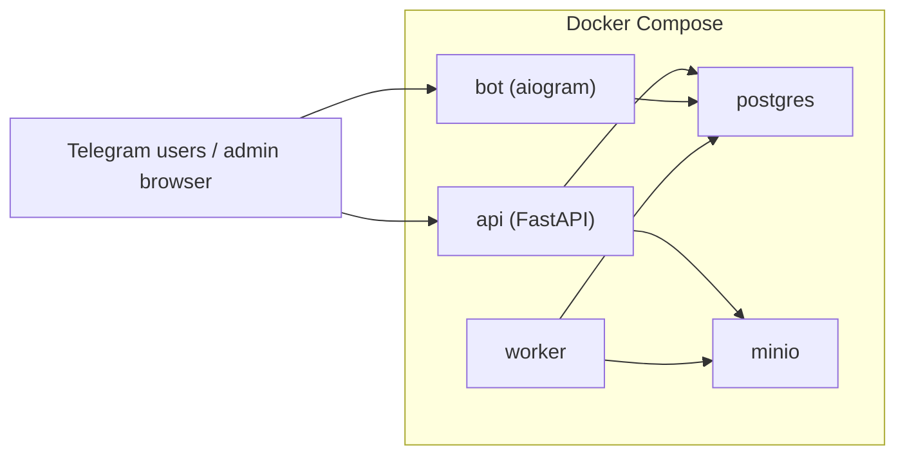

# Pitch CopyTrade Bot Blueprint for Codex

Дата: 2026-03-10
Статус: approved architecture baseline

## Исходные материалы
- `/Users/alexey/site/PitchCopyTrade/doc/PitchCopyTradeBot.pdf`
- `/Users/alexey/site/PitchCopyTrade/doc/Brand book Partner Finance.pdf`
- `/Users/alexey/site/PitchCopyTrade/doc/figma.html`
- `/Users/alexey/site/PitchCopyTrade/doc/figma.htm`

## Зафиксированные решения
- Язык: `Python 3.12`.
- Framework stack:
  - `FastAPI` для web/admin/API;
  - `aiogram 3` для Telegram-бота;
  - `SQLAlchemy 2` + `Alembic` для ORM и миграций;
  - `PostgreSQL` как основное хранилище;
  - `MinIO` как отдельный контейнер для файлов;
  - `Jinja2` + `HTMX` для server-rendered admin/author UI;
  - `Docker Compose` для локального сервера и dev orchestration.
- Платежи в первой версии: `stub/manual`; следующий целевой провайдер - `Т-Банк`.
- Нужны все 3 модели подписки:
  - на стратегию;
  - на автора;
  - на bundle.
- Нужны:
  - trial period;
  - promo codes;
  - auto-renew flag;
  - manual discounts.
- Автор входит в кабинет по `login/password`.
- Модерация рекомендаций нужна опционально и зависит от прав автора.
- Первая версия поддерживает только `российские акции`.
- Поля рекомендации должны быть опционально поддержаны все:
  - текст;
  - бумага;
  - направление;
  - вход;
  - стоп;
  - тейки;
  - горизонт;
  - вложение.
- Типы публикаций обязательны с первого релиза:
  - `new idea`;
  - `update`;
  - `close`;
  - `cancel`.
- Автор видит только агрегированное количество подписчиков, без PII.
- Роли: `admin`, `author`, `moderator`.
- В MVP нужны черновики юридических страниц:
  - дисклеймер;
  - оферта;
  - политика обработки данных;
  - согласие перед оплатой.
- Язык интерфейсов: только `русский`.
- Таймзона: пользовательская, с базовым fallback `Europe/Moscow`.
- Нужен учет источника лида с первого релиза.

## 1. Почему меняем прежнюю архитектуру
Предыдущий вариант без framework и без БД был приемлем для узкого proof of concept, но уже не соответствует текущим условиям:
- много авторов;
- ACL;
- три типа подписок;
- trial/promo/discount/renewal;
- юридические подтверждения;
- платежный контур;
- файлы во втором контейнере;
- запуск через Docker.

Для такой системы file-first persistence становится лишним ограничением. Поэтому базовая архитектура меняется на `FastAPI + PostgreSQL + MinIO`.

## 2. Продуктовая цель
Собрать сервис `PitchCopyTrade`, в котором:
- пользователь приходит из рекламы, рекомендации или реферального источника в Telegram-бот;
- видит витрину стратегий;
- оформляет одну из трех моделей подписки;
- оплачивает доступ по СБП;
- получает только те рекомендации, которые разрешены его активными entitlements;
- автор публикует рекомендации через web-кабинет;
- админ и модератор контролируют публикации, платежи, подписки, доступы и юридические подтверждения.

## 3. Технологический стек

### Backend
- `FastAPI`
- `SQLAlchemy 2`
- `Alembic`
- `Pydantic Settings`
- `Jinja2`
- `HTMX`

### Bot
- `aiogram 3`

### Data and files
- `PostgreSQL 16`
- `MinIO`

### Runtime
- `Docker`
- `Docker Compose`

### Why this stack
- `FastAPI` дает нормальную структуру для API, admin routes, middleware, forms и auth.
- `aiogram 3` подходит для изолированного bot-контра и не мешает web-слою.
- `PostgreSQL` нужен для транзакций, ролей, подписок, платежей и auditability.
- `MinIO` решает вопрос со вторым контейнером под вложения и будущую совместимость с S3-compatible storage.
- `Jinja2 + HTMX` позволяют быстро собрать админку без отдельного SPA.

## 4. Деплой-топология



Минимальный локальный набор сервисов:
- `api`
- `bot`
- `worker`
- `postgres`
- `minio`

## 5. Роли и зоны ответственности

### `admin`
- управляет пользователями и авторами;
- видит все стратегии, подписки, платежи, рекомендации;
- управляет ролями и moderation policies;
- подтверждает stub/manual платежи;
- редактирует юридические документы и тарифы.

### `moderator`
- видит очередь публикаций;
- переводит рекомендации в `approved/rejected`;
- не управляет платежными и системными секретами;
- не видит лишние персональные данные клиентов, если это не нужно для модерации.

### `author`
- входит в web-кабинет по логину и паролю;
- работает только со своими стратегиями;
- создает и редактирует свои рекомендации;
- видит только количество подписчиков по своим стратегиям;
- не видит PII клиентов.

## 6. Subscription model

### Типы продуктов
1. `strategy subscription`
2. `author subscription`
3. `bundle subscription`

### Логика entitlement
- Подписка на стратегию открывает доступ только к одной стратегии.
- Подписка на автора открывает доступ ко всем опубликованным стратегиям автора.
- Подписка на bundle открывает доступ к стратегиям, включенным в bundle.

### Дополнительные коммерческие механики
- `trial_days`
- `promo_code`
- `manual_discount_rub`
- `autorenew_enabled`

Все эти поля должны присутствовать в доменной модели уже в foundation-этапе, даже если часть UI появится позже.

## 7. Клиентский UX

### В Telegram-боте
- `/start`
- onboarding
- дисклеймер
- витрина стратегий
- карточка стратегии
- выбор подписки
- создание платежа
- `Мои подписки`
- история доступных рекомендаций

### Обязательные сущности интерфейса
- lead source tagging;
- фиксация согласия перед оплатой;
- таймзона пользователя;
- понятный статус доступа и срока подписки.

## 8. UX кабинета автора

### Product stance
Кабинет автора - не trading terminal и не generic admin form. Это publishing workspace для создания, проверки, планирования и публикации рекомендаций.

Визуальный ориентир для реализации: `doc/author_cabinet_prototype/index.html`.

### Что берем из видео-референса
- модульную desktop-сцену;
- боковые панели;
- быстрый доступ к сущностям и переключение контекста;
- идею рабочего пространства, а не одиночной страницы.

### Что не переносим
- терминальный шум;
- перегруз графиками и трейдинговыми виджетами;
- смешение редакторской задачи и торгового UI в одном визуальном слое;
- длинную линейную форму без preview, validation и draft workflow.

### Базовая компоновка
1. `left rail` - стратегии автора, pinned items, drafts, quick actions, фильтры.
2. `central canvas` - текущий режим работы: composer, pipeline, analytics, calendar или history.
3. `right inspector` - validation, Telegram preview, агрегированная аудитория, publish actions.

### Обязательные режимы одного кабинета
- `workspace`
- `pipeline`
- `analytics`
- `calendar`
- `history`

Все режимы должны жить в одном shell и работать с одной моделью draft state. Переключение режима не должно ломать черновик или переносить пользователя в чужой по логике раздел.

### UX best practices для author console
- `progressive disclosure`: показывать только релевантный слой задачи;
- `draft-first` и `autosave-first`;
- группировка полей по задаче: тезис, сделки, вложения, schedule, publish actions;
- validation и preview в одном рабочем контексте;
- явные empty states и next actions;
- desktop table для multi-leg идеи и mobile card/list fallback;
- clone/duplicate шаблонов и последних публикаций;
- pipeline, calendar и history как разные срезы одного publishing flow;
- агрегированные subscriber metrics без доступа автора к PII клиентов.

### Обязательные UX-компоненты
- command strip с типом публикации `new/update/close/cancel`;
- rail с черновиками, pinned strategies и быстрым открытием draft;
- multi-leg editor для нескольких сделок в одной идее;
- upload zone для screenshot/PDF;
- schedule block;
- moderation badge/state;
- Telegram preview;
- validation summary;
- subscriber counter только в агрегированном виде.

### Базовый сценарий
1. Автор входит в кабинет.
2. Из rail открывает свою стратегию или черновик в 1 клик.
3. Работает в режиме `workspace`.
4. Создает публикацию типа `new/update/close/cancel`.
5. Заполняет тезис, структурированные сделки и при необходимости вложения.
6. Смотрит validation и Telegram preview справа.
7. Отправляет в review, schedule или публикует сам, если разрешено правами.
8. При необходимости уходит в `pipeline`, `calendar` или `history`, не теряя draft state.

### Поля рекомендации
Каждое из этих полей должно поддерживаться как опциональное, а не жестко обязательное:
- `summary_text`
- `instrument`
- `side`
- `entry_from`
- `entry_to`
- `stop_loss`
- `take_profit_1/2/3`
- `time_horizon`
- `attachment`

### Recommendation kinds
- `new_idea`
- `update`
- `close`
- `cancel`

### Recommendation statuses
- `draft`
- `review`
- `approved`
- `scheduled`
- `published`
- `closed`
- `cancelled`
- `archived`

## 9. Юридические страницы и согласия
В MVP нужны хотя бы draft-версии:
- `disclaimer`
- `offer`
- `privacy_policy`
- `payment_consent`

Нужно хранить:
- версию документа;
- дату публикации;
- активную версию;
- факт принятия пользователем перед оплатой.

## 10. Каталог инструментов
Первая версия поддерживает только `российские акции`.

Минимальные поля инструмента:
- `ticker`
- `name`
- `board`
- `lot_size`
- `currency`
- `is_active`
- `instrument_type = equity`

## 11. Доменная модель

### Accounts
- `users`
- `roles`
- `user_roles`
- `author_profiles`

### Catalog and products
- `instruments`
- `strategies`
- `bundles`
- `bundle_members`
- `subscription_products`

### Commerce
- `lead_sources`
- `promo_codes`
- `payments`
- `subscriptions`

### Content
- `recommendations`
- `recommendation_legs`
- `recommendation_attachments`

### Compliance
- `legal_documents`
- `user_consents`

### Audit
- `audit_events`

## 12. Архитектурный принцип по файлам
Файлы больше не являются primary source of truth. Теперь:
- бизнес-данные живут в `PostgreSQL`;
- вложения живут в `MinIO`;
- в БД хранится только metadata об объекте в хранилище;
- structured logs идут в stdout/stderr контейнеров;
- audit-события дополнительно пишутся в таблицу `audit_events`.

## 13. База данных

### Критические требования
- UUID primary keys;
- timestamps `created_at` / `updated_at`;
- явные enum/status columns;
- foreign keys и unique constraints;
- миграции только через `Alembic`;
- никакого implicit schema drift.

### Что важно на старте
- продукты и подписки нужно моделировать гибко из-за 3 subscription types;
- `author` и `moderator` не должны быть "магическими if-ами", только через роли;
- платежи должны быть идемпотентны;
- consent должен фиксироваться на уровне БД.

## 14. MinIO

### Что храним в MinIO
- screenshots;
- PDF attachments;
- будущие экспортные файлы.

### Что храним в БД
- bucket name;
- object key;
- original file name;
- content type;
- size;
- uploaded_by;
- recommendation_id.

## 15. Docker Compose baseline

### Сервисы
- `api`
- `bot`
- `worker`
- `postgres`
- `minio`

### Важные env-переменные
- `DATABASE_URL`
- `POSTGRES_DB`
- `POSTGRES_USER`
- `POSTGRES_PASSWORD`
- `MINIO_ROOT_USER`
- `MINIO_ROOT_PASSWORD`
- `MINIO_BUCKET_UPLOADS`
- `TELEGRAM_BOT_TOKEN`
- `APP_SECRET_KEY`
- `SBP_PROVIDER=stub_manual`

## 16. Платежная архитектура

### Сейчас
- `stub/manual`
- payment создается как обычная запись в БД;
- админ вручную переводит платеж в `paid`;
- подписка активируется сервисным слоем;
- вся логика провайдера изолирована через adapter interface.

### Потом
- `T-Bank` adapter без переделки доменного слоя.

## 17. Учет источника лида
Нужно поддержать с первого релиза:
- `utm_source`
- `utm_medium`
- `utm_campaign`
- `ref_code`
- `source_type` (`ads`, `blogger`, `organic`, `direct`, `referral`)

Это должно попадать:
- в запись пользователя;
- в платеж;
- в подписку;
- в admin filters/reporting.

## 18. Таймзоны
- Базовый timezone проекта: `Europe/Moscow`.
- У каждого пользователя должен быть свой `timezone`, если он известен.
- Все даты в БД храним в UTC, отображение делаем в user timezone либо в MSK fallback.

## 19. Дизайн-направление
Сохраняем визуальный язык из брендбука Partner Finance:
- минимализм;
- типографика;
- инфографика;
- глубокий синий на светлом фоне;
- красный только как акцент и alert state.

Не используем:
- их логотип;
- их название;
- их символику.

## 20. Проектная структура

```text
PitchCopyTrade/
  .env
  docker-compose.yml
  Dockerfile
  alembic.ini
  alembic/
  src/
    pitchcopytrade/
      main.py
      api/
      bot/
      worker/
      core/
      db/
      services/
      storage/
      templates/
  tests/
  doc/
```

## 21. Этапы реализации

### Phase 0. Foundation
- Docker baseline
- FastAPI app
- aiogram entrypoint
- PostgreSQL config
- MinIO config
- SQLAlchemy models
- Alembic initial migration
- base health endpoints

### Phase 1. Accounts and auth
- web login/password
- roles
- author profile
- admin / moderator access split

### Phase 2. Catalog and products
- instruments
- strategies
- bundles
- subscription products
- lead sources

### Phase 3. Payments and subscriptions
- stub/manual payments
- trials
- promo codes
- discounts
- subscription activation
- entitlement resolution

### Phase 4. Author publishing
- recommendation composer
- attachments to MinIO
- moderation workflow
- publish and delivery

### Phase 5. Telegram delivery
- onboarding
- showcase
- my subscriptions
- recommendation history

### Phase 6. Compliance and ops
- legal pages
- consents
- audit UI
- filters and exports

## 22. Acceptance criteria для foundation-этапа
- проект поднимается через Docker Compose;
- есть контейнеры `api`, `bot`, `worker`, `postgres`, `minio`;
- `FastAPI` отвечает на `/health`;
- `Alembic` содержит initial migration;
- основные таблицы домена описаны;
- `.env` и config согласованы с новым стеком;
- код и документы больше нигде не предполагают file-first persistence.

## 23. Главное архитектурное правило
В этом проекте нельзя больше строить "быстрые временные решения" вокруг файлового слоя как primary store. Базовая модель теперь такая:
- framework-first;
- DB-first;
- object-storage for files;
- roles and entitlements as first-class domain;
- payments and consents as auditable state transitions.
